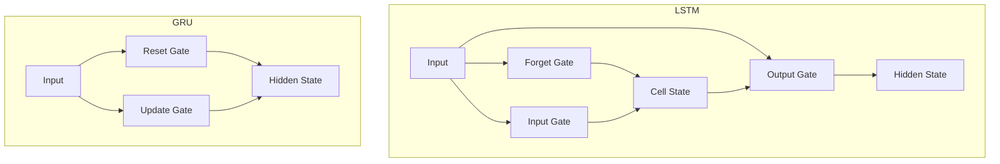

# Comprehensive Comparative Notes: Machine Learning & Deep Learning

This document provides a high-depth technical comparison of algorithms, architectures, and concepts in ML/DL.

---

## 1. Core Algorithms: Supervised & Unsupervised

### 1.1 Classification vs Regression

| Feature | Classification | Regression |
| :--- | :--- | :--- |
| **Output Type** | Discrete Class Label (e.g., Cat/Dog, Spam/Not Spam). | Continuous Quantity (e.g., Price, Temp). |
| **Mapping** | $f: X \to \{c_1, c_2, ..., c_k\}$ | $f: X \to \mathbb{R}$ |
| **Evaluation** | Accuracy, F1-Score, ROC-AUC, Precision, Recall. | MSE, RMSE, MAE, R-squared. |
| **Algorithm Examples**| Logistic Regression, SVM, Random Forest Classifier. | Linear Regression, Ridge/Lasso, XGBoost Regressor. |

> [!NOTE]
> **Logistic Regression** is a classification algorithm despite its name, because it estimates the *probability* of a class, but is used for categorical outcomes.

### 1.2 Linear vs Logistic Regression

| Feature | Linear Regression | Logistic Regression |
| :--- | :--- | :--- |
| **Equation** | $y = \mathbf{w}^T\mathbf{x} + b$ (Linear combination). | $P(y=1) = \sigma(\mathbf{w}^T\mathbf{x} + b)$ (Sigmoid transformation). |
| **Range** | $(-\infty, +\infty)$. | $(0, 1)$ (Probabilities). |
| **Cost Function** | Mean Squared Error (MSE): $\frac{1}{n}\sum(y-\hat{y})^2$. | Binary Cross-Entropy (Log Loss): $-\sum [y\log(\hat{y}) + (1-y)\log(1-\hat{y})]$. |
| **Decision Boundary**| Not applicable (predicts value). | Linear decision boundary. |
| **Assumptions** | Homoscedasticity, Normality of errors, Linearity. | Feature independence (less strict), Linearity of log-odds. |

**Code Snippet (Scikit-learn):**
```python
from sklearn.linear_model import LinearRegression, LogisticRegression

# Linear: Predicting House Price
reg = LinearRegression().fit(X_train, y_continuous)
pred_price = reg.predict(X_test)

# Logistic: Predicting Churn (0/1)
clf = LogisticRegression(solver='liblinear').fit(X_train, y_categorical)
pred_prob = clf.predict_proba(X_test)[:, 1] # Probability of Class 1
```

### 1.3 Naive Bayes vs Logistic Regression

| Comparison Point | Naive Bayes (Generative) | Logistic Regression (Discriminative) |
| :--- | :--- | :--- |
| **Core Approach** | Models $P(x|y)$ and $P(y)$ to find $P(y|x)$. | Models $P(y|x)$ directly. |
| **Assumption** | **Strong Independence**: Features are independent given class. | **Linear Relationship**: Log-odds related linearly to input. |
| **Data Efficiency** | Reaches convergence faster with less data (if assumption holds). | Needs more data to learn the decision boundary well. |
| **Performance** | Great for NLP/Text (Bag of Words) where dims are high. | Generally outperforms NB if data is sufficient and features correlated. |
| **Outliers** | Robust (probabilities rely on counts). | Sensitive (tries to minimize global error). |

> [!IMPORTANT]
> **Generative vs Discriminative Pivot**: Naive Bayes (Generative) cares *how* the data was generated. Logistic Regression (Discriminative) only cares about the *boundary* between classes.

### 1.4 SVM vs Neural Networks

| Feature | Support Vector Machine (SVM) | Neural Networks (Deep Learning) |
| :--- | :--- | :--- |
| **Optimization** | Convex Optimization (Global Minimum guaranteed). | Non-convex Optimization (Local Minima, Saddle points). |
| **Data Size** | Excellent for Small to Medium datasets (<100k). | Data hungry; requires Large datasets to generalize. |
| **Feature Eng.** | Critical (needs Kernels, Scaling). | Automated (Feature learning layers). |
| **Interpretability**| Medium (Support vectors define boundary). | Low (Black box learned representations). |
| **Complexity** | $O(N^2)$ to $O(N^3)$ (Quadratic with dataset size). | $O(N \cdot W)$ (Linear with data, but heavy compute). |

**When to use:**
*   **SVM:** Tabular data, wide datasets (features > samples), strictly limited data.
*   **NN:** Unstructured data (Images, Text, Audio), massive datasets.

### 1.5 Clustering: K-means vs Hierarchical vs DBSCAN

| Algo | K-means | Hierarchical (Agglomerative) | DBSCAN |
| :--- | :--- | :--- | :--- |
| **Type** | Partitioning (Centroid-based). | Hierarchy-based (Tree). | Density-based. |
| **Input Params** | **$K$** (Must assume/know # clusters). | Distance metric, Linkage type. | **$\epsilon$** (radius), **MinPts** (density). |
| **Cluster Shape** | Spherical/Convex only. | Convex/Non-convex (depends on linkage). | Arbitrary shapes (e.g., moons, rings). |
| **Outliers** | Sensitive (Centroids pulled by outliers). | Sensitive (Chaining effect). | **Robust** (Classifies as -1/Noise). |
| **Complexity** | $O(N)$ (Fast, Linear). | $O(N^2)$ to $O(N^3)$ (Slow). | $O(N \log N)$ (Moderate). |

**Pitfall:** K-means fails on "concentric circles" data. DBSCAN handles it easily.

### 1.6 Dimensionality Reduction: PCA vs t-SNE vs UMAP

| Feature | PCA (Principal Component Analysis) | t-SNE (t-Distributed Stochastic Neighbor Embedding) | UMAP (Uniform Manifold Approximation) |
| :--- | :--- | :--- | :--- |
| **Linearity** | **Linear**. Projects to max variance directions. | **Non-Linear**. Manifold learning. | **Non-Linear**. Manifold learning. |
| **Preservation** | Global Structure (Variance). | Local Structure (Neighborhoods). Global structure often lost. | Balance of Local & Global Structure. |
| **Speed** | Very Fast (Matrix Eigendecomposition). | Slow ($O(N^2)$). | Fast (Faster than t-SNE). |
| **Interpretability**| High (Eigenvectors = linear mix of features). | Low (Distances in plot are not always meaningful). | Low/Medium. |
| **Use Case** | Pre-processing, Noise reduction, Compression. | Visualization (2D/3D) of high-dim clusters. | Visualization & Feature Engineering. |

### 1.7 [Expert] Anomaly Detection: Isolation Forest vs One-Class SVM vs LOF

| Algo | Isolation Forest | One-Class SVM | Local Outlier Factor (LOF) |
| :--- | :--- | :--- | :--- |
| **Core Idea** | **Isolation**: Anomalies are easier to isolate (shallow tree paths). | **Boundary**: Learns a tight envelope around "normal" data. | **Density**: Compares local density of pt with neighbors. |
| **Dimensionality**| Handles high-dim variables well. | Struggles with high-dim; sensitive to hyperparameters. | Fails in high-dim (Distance curse). |
| **Speed** | Fast (Ensemble of trees). | Slow ($O(N^2)$). | Slow (Nearest Neighbor search). |
| **Type** | Global anomaly detection. | Global boundary detection. | Local anomaly detection. |

---

## 2. Advanced Algorithms & Ensembles

### 2.1 Decision Trees vs Random Forest vs Gradient Boosting

| Approach | Decision Trees | Random Forest (Bagging) | Gradient Boosting (Boosting) |
| :--- | :--- | :--- | :--- |
| **Mechanics** | Single hierarchical rule set. | Ensemble of **independent** deep trees. | Ensemble of **sequential** shallow trees (stumps). |
| **Bias/Variance** | Low Bias / **High Variance** (Overfits easily). | Low Bias / **Reduced Variance** (Averaging). | **Low Bias** / Low Variance (Iterative error correction). |
| **Parallelism** | Yes (Single tree construction). | **Yes** (Trees grown in parallel). | **No** (Trees grown sequentially). |
| **Interpretability**| High (White-box rules). | Medium (Feature Importances). | Low (Black-box). |
| **Robustness** | Fragile (Small data change = different tree). | Robust (Aggregated decision). | Sensitive to **Noise/Outliers** (Tries to fit errors). |

### 2.2 Ensemble Strategies: Bagging vs Boosting vs Stacking

*   **Bagging (Bootstrap Aggregating):**
    *   *Concept:* Train $N$ models independently on random subsets (with replacement). Vote/Average results.
    *   *Goal:* Reduce **Variance**.
    *   *Example:* Random Forest.
*   **Boosting:**
    *   *Concept:* Train models sequentially. Model $N$ focuses on errors made by Model $N-1$ (re-weighting hard examples).
    *   *Goal:* Reduce **Bias** and Variance.
    *   *Example:* AdaBoost, GBM, XGBoost.
*   **Stacking (Stacked Generalization):**
    *   *Concept:* Train base models (Tier 1) and use their predictions as *input features* for a meta-learner (Tier 2).
    *   *Goal:* Blending strengths of diverse algorithms (e.g., NN + XGBoost + SVM).
    *   *Example:* Kaggle Winning Solutions.

### 2.3 Gradient Boosting Rivals: XGBoost vs LightGBM vs CatBoost

| Feature | XGBoost (eXtreme Gradient Boosting) | LightGBM (Light Gradient Boosting Machine) | CatBoost (Categorical Boosting) |
| :--- | :--- | :--- | :--- |
| **Tree Growth** | **Level-wise** (Depth-first). Grows balanced trees. | **Leaf-wise** (Best-first). Grows deep, asymmetric trees. | **Symmetric** trees (Balanced). |
| **Speed** | Fast (Hardware optimized). | **Fastest** (Histogram-based bucketing). | Moderate (Slower training, fast inference). |
| **Categorical Data**| One-hot encoding required (historically). | Native support (Integer encoding). | **Best Native Support** (Ordered Target Statistics). |
| **Overfitting** | Prone if depth not tuned. | **High risk** on small data (Leaf-wise grows fast). | Robust defaults reduce overfitting. |
| **Dominance** | General purpose, industry standard. | Huge datasets, efficiency constrained envs. | Datasets with many categorical features. |

**Code Snippet (Differences):**
```python
# XGBoost
clf_xgb = xgb.XGBClassifier(tree_method='hist', enable_categorical=True)

# LightGBM (Note: Handling categorical features column indices)
clf_lgbm = lgbm.LGBMClassifier(categorical_feature=[0, 2])

# CatBoost (Native text/cat support)
clf_cat = cb.CatBoostClassifier(cat_features=['city', 'type'], verbose=0)
```

### 2.4 Sequence Modeling: RNN vs LSTM vs GRU vs Transformers

| Algo | RNN (Recurrent Neural Net) | LSTM (Long Short-Term Memory) | GRU (Gated Recurrent Unit) | Transformer (Self-Attention) |
| :--- | :--- | :--- | :--- | :--- |
| **Problem Solved** | Sequence variable length. | **Vanishing Gradient** in RNNs. | Complexity of LSTM. | **Sequential Processing** bottleneck. |
| **Memory** | Short-term (Overwrites state). | Long-term (Cell state highway). | Long-term (Simplified). | Global Context (Attention matrix). |
| **Training** | $O(N)$ Sequential. Slow. | $O(N)$ Sequential. Slow. | $O(N)$ Sequential. Faster than LSTM. | **$O(1)$ Parallelizable** (Time dim). |
| **Dominant Era** | 1980s - 2013. | 2014 - 2017 (Seq2Seq, Translation). | 2015 - 2017 (Mobile/Efficiency). | 2017 - Present (BERT, GPT, ViT). |

> [!TIP]
> **Use Transformers** for almost all modern NLP/Sequence tasks given sufficient data. Use **GRU/LSTM** only for constrained IoT devices or very short time-series where low latency/params matter.

### 2.5 CNN Architectures: VGG vs ResNet vs Inception vs EfficientNet

| Architecture | Key Innovation | Param Count | Pro | Con |
| :--- | :--- | :--- | :--- | :--- |
| **VGG-16** | 3x3 Conv blocks. Simplicity. | ~138M (Huge). | Simple structure, good for style transfer. | Extremely heavy, slow inference. |
| **ResNet-50** | **Residual (Skip) Connections**. | ~25M. | Solved vanishing gradient, trainable to 1000+ layers. | - |
| **Inception(v3)**| **Split-Transform-Merge**. Parallel kernels. | ~24M. | Captures multi-scale features efficiently. | Complex architecture, hard to modify. |
| **EfficientNet**| **Compound Scaling** (Width, Depth, Res). | ~5M (B0). | **SOTA Efficiency**. Best Accuracy/FLOPs ratio. | Complex scaling rules. |

### 2.6 [Expert] Recommender Systems: Collaborative vs Content-Based

| Feature | Collaborative Filtering (CF) | Content-Based Filtering (CBF) |
| :--- | :--- | :--- |
| **Data Source** | User-Item Interactions (Matrix of ratings/clicks). | Item Attributes (Tags, Text) & User Profiles. |
| **Mechanism** | "Users like you liked X" (User-User or Item-Item). | "You liked Sci-Fi, so here is more Sci-Fi". |
| **Cold Start** | **Fails** for new users/items (No interaction history). | **Works** for new items (if tags exist). Fails for new users. |
| **Serendipity** | High (Can recommend totally new categories). | Low (Tends to over-specialize/pigeonhole). |
| **Technique** | Matrix Factorization, Nearest Neighbors. | TF-IDF, Cosine Similarity, Embeddings. |

---

## 3. Deep Learning Architectures & Components

### 3.1 Network Paradigms: Feedforward (MLP) vs RNN vs CNN

| Feature | Feedforward (MLP) | Recurrent (RNN) | Convolutional (CNN) |
| :--- | :--- | :--- | :--- |
| **Input Data** | Tabular, Flat vectors. | Sequential (Time-series, Text). | Grid-like (Images, Spatial). |
| **Connectivity** | Dense (All-to-All). | Recurrent (Loops back). | Sparse (Local filters). |
| **Parameter Sharing**| No (Weights unique to connections). | **Yes** (Same weight across time). | **Yes** (Same filter across space). |
| **Spatial Invariance**| No. | No (Temporal invariance). | **Yes** (Shift invariance). |

### 3.2 LSTM vs GRU Mechanisms

| Component | LSTM (Long Short-Term Memory) | GRU (Gated Recurrent Unit) |
| :--- | :--- | :--- |
| **Gates** | **3**: Input, Forget, Output. | **2**: Update, Reset. |
| **State** | Separates **Cell State** ($C_t$) and Hidden State ($h_t$). | Integrated Hidden State ($h_t$) only. |
| **Parameters** | More ($4 \times$ Size). | Fewer ($3 \times$ Size). |
| **Convergence** | Slower, but potentially more expressive. | Faster training. |
| **Performance** | Better on very long sequences. | Comparable on shorter sequences. |

**Mermaid Diagram: LSTM vs GRU Flow**


### 3.3 Generative Models: GAN vs VAE vs Diffusion Models

| Feature | GAN (Adversarial) | VAE (Probabilistic) | Diffusion (Denoising) |
| :--- | :--- | :--- | :--- |
| **Mechanism** | Generator vs Discriminator Game. | Encoder $\to$ Latent $\mu, \sigma$ $\to$ Decoder. | Forward Noise $\to$ Reverse Denoising. |
| **Training** | Unstable (Minimax). Mode collapse. | Stable (ELBO maximization). | Stable (MSE on noise). Slow training. |
| **Sample Quality** | High fidelity, sharp. | Blurry/Smooth. | **SOTA Fidelity** & Diversity. |
| **Inference Speed**| Fast (One pass). | Fast (One pass). | **Slow** (Iterative denoising steps). |
| **Example** | StyleGAN, CycleGAN. | Stable Diffusion (Latent Diff), DALL-E 2/3. |

### 3.4 Transformer Paradigms: BERT vs GPT vs T5

| Model | BERT (Encoder-only) | GPT (Decoder-only) | T5 (Encoder-Decoder) |
| :--- | :--- | :--- | :--- |
| **Attention** | **Bidirectional** (Sees future tokens). | **Unidirectional/Causal** (Masked future). | Bidirectional Enc + Causal Dec. |
| **Objective** | Masked LM (Fill in blank). | Next Token Prediction (Autoregressive). | Span Corruption (Seq2Seq). |
| **Use Case** | Understanding, Classification, NER, QA. | Generation, Chatbots, Creative writing. | Translation, Summarization. |

### 3.5 CV Tasks: Segmentation & Detection

**Segmentation: U-Net vs Mask R-CNN**
*   **U-Net:** Fully Convolutional. Symmetric Encoder-Decoder with skip connections. *Best for:* Medical Imaging, semantic segmentation where precise boundaries matter.
*   **Mask R-CNN:** Two-stage. Extends Faster R-CNN with a mask branch. *Best for:* Instance segmentation (counting distinct objects).

**Detection: YOLO vs R-CNN Variants**
| Algo | YOLO (You Only Look Once) | Faster R-CNN / SSD |
| :--- | :--- | :--- |
| **Type** | **One-Stage** Detector. | **Two-Stage** (RPN + Classifier). |
| **Mechanism** | Grid-based regression. Predicts boxes directly. | Proposes regions $\to$ Refines them. |
| **Speed** | Real-time (>45 FPS). | Slow (<10 FPS). |
| **Accuracy** | Lower on small objects (historically). | Higher accuracy, better implementation. |

**Code Snippet (YOLOv8 Inference):**
```python
from ultralytics import YOLO

# Load model (Pre-trained on COCO)
model = YOLO('yolov8n.pt') 

# Run inference (One line!)
results = model('image.jpg')
```


### 3.6 Normalization: Batch vs Layer vs Instance

*   **Batch Norm (BN):** Normalizes across the *batch dimension* ($N, C, H, W$).
    *   *Pros:* Accelerates training, regularizes.
    *   *Cons:* Fails with small batch sizes (e.g., < 8). Fails in RNNs.
*   **Layer Norm (LN):** Normalizes across the *feature dimension* ($C, H, W$) for a single sample.
    *   *Use:* Transformers, RNNs. Independence from batch size.
*   **Instance Norm (IN):** Normalizes per channel per sample.
    *   *Use:* Style Transfer, GANs (removes contrast info).

---

## 4. Training, Optimization & Activations

### 4.1 Optimizers: SGD vs Adam vs RMSprop vs Muon

| Optimizer | Mechanism | Best For | Trade-off |
| :--- | :--- | :--- | :--- |
| **SGD** | Updates via gradient direction. | Finding generalizable global minima (CV). | Slow convergence, gets stuck in saddle points. |
| **SGD + Momentum**| Adds velocity to dampen oscillation. | Standard for ResNets/ConvNets. | Adds hyperparameter ($\alpha$). |
| **Adam** | Adaptive LR (RMSprop) + Momentum. | **Default choice** for most tasks (NLP, Transformers). | Can overshoot optimal solution; weight decay implementation varies (AdamW). |
| **Muon** | Momentum Orthogonal Optimizer. | **Massive Scale** training (>7B params). | Experimental; designed to handle spectral shifts in large weight matrices. |

### 4.2 Gradient Descent Strategies

| Strategy | Batch Size | Pros | Cons |
| :--- | :--- | :--- | :--- |
| **Batch GD** | $N$ (Full Dataset). | Stable error gradient. | Computationally prohibitive; can't fit in VRAM. |
| **Stochastic GD**| $1$ sample. | Frequent updates, escapes local minima. | High variance, noisy convergence path. |
| **Mini-Batch GD**| $B$ (e.g., 32, 256). | **Best of both**: Parallelizable, stable enough. | Needs tuning (Batch Size is a critical hyperparam). |

### 4.3 Regularization: L1 vs L2 vs Elastic Net

*   **L1 (Lasso Regression):** $\text{Loss} + \lambda \sum |w|$.
    *   *Effect:* **Sparsity**. Forces coefficients to exactly zero.
    *   *Use:* Feature selection.
*   **L2 (Ridge Regression/Weight Decay):** $\text{Loss} + \lambda \sum w^2$.
    *   *Effect:* **shrinkage**. Small but non-zero weights.
    *   *Use:* Preventing overfitting in Neural Networks (Standard).
*   **Elastic Net:** $\alpha L1 + \beta L2$.
    *   *Use:* When features are correlated (L1 picks 1 randomly, Elastic Net picks both).

### 4.4 Combating Overfitting: Dropout vs Early Stopping vs Augmentation

| Technique | Mechanism | Use When |
| :--- | :--- | :--- |
| **Dropout** | Randomly zeros neurons during training ($p=0.5$). | Deep dense layers; prevents co-adaptation. |
| **Early Stopping**| Stop when Validation Loss stops dropping. | Always (Safety net). |
| **Data Augmentation**| Create synthetic variations (flip, rotate). | Images/Audio where invariance is desirable. |

### 4.5 Weight Initialization: Xavier vs He vs LeCun

| Initialization | Designed For Activation | Goal |
| :--- | :--- | :--- |
| **Xavier (Glorot)**| **Sigmoid / Tanh**. | Keeps variance of input = variance of output. |
| **He (Kaiming)** | **ReLU / Leaky ReLU**. | Accounts for ReLU zeroing out half the inputs. |
| **LeCun** | **SELU**. | Maintains self-normalization properties. |

### 4.6 Loss Functions

*   **Cross-Entropy (Log Loss):** Standard for classification. Punishes confident errors exponentially.
*   **Hinge Loss:** Standard for SVMs. $\max(0, 1 - y \cdot \hat{y})$. Maximizes margin.
*   **Focal Loss:** $(1-p_t)^\gamma \log(p_t)$.
    *   *Key Difference:* Down-weights "easy" examples (where $p_t \approx 1$).
    *   *Use:* Extreme Class Imbalance (Object Detection backgrounds).

### 4.7 Activation Functions

| Activation | Formula | Gradient Property | Use Case |
| :--- | :--- | :--- | :--- |
| **Sigmoid** | $\frac{1}{1+e^{-x}}$ | **Vanishing Gradient** (max grad 0.25). | Output layer (Binary Class). Avoid in hidden layers. |
| **Tanh** | $\frac{e^x - e^{-x}}{e^x + e^{-x}}$ | Zero-centered, but still vanishes. | Some RNNs; legacy default. |
| **ReLU** | $\max(0, x)$ | Non-saturating for $x>0$. **Dead ReLU** for $x<0$. | **Default** for Hidden Layers (CNN/MLP). |
| **Leaky ReLU** | $\max(0.01x, x)$ | Fixes Dead ReLU. | If network dies during training. |
| **Swish (SiLU)**| $x \cdot \sigma(x)$ | Smooth, non-monotonic. | SOTA Deep Learning (EfficientNets, LLMs). |

---

## 5. Evaluation Metrics

### 5.1-5.2 Classification Metrics: Accuracy vs Precision/Recall vs F1 vs AUC

| Metric | Formula | Use When | Use With |
| :--- | :--- | :--- | :--- |
| **Accuracy** | $\frac{TP+TN}{Total}$ | **Balanced Classes** Only. | Balanced datasets. |
| **Precision** | $\frac{TP}{TP+FP}$ | Cost of **False Positive** is high (e.g., Spam Filter, Prison Sentencing). | F1-Score. |
| **Recall (Sensitivity)**| $\frac{TP}{TP+FN}$ | Cost of **False Negative** is high (e.g., Cancer Detection, Fraud). | F1-Score. |
| **F1-Score** | $2 \cdot \frac{P \cdot R}{P+R}$ | **Imbalanced Classes**. Balances P & R. | Use Macro-F1 for multi-class. |
| **ROC-AUC** | Area under TPR vs FPR curve. | Evaluating ranking ability. **Insensitive using thresholds**. | **Balanced** data. |
| **PR-AUC** | Area under Precision vs Recall curve. | **Highly Imbalanced** data (e.g., 1% positive class). | Fraud detection. |

> [!CAUTION]
> Never use Accuracy for Fraud Detection (99.9% accuracy is achieved by predicting "Not Fraud" for everyone). Use **PR-AUC** or **Recall**.

### 5.3 Regression Metrics: MSE vs MAE vs RMSE vs Huber

| Metric | Formula | Outlier Sensitivity | Interpretation |
| :--- | :--- | :--- | :--- |
| **MSE** | $\frac{1}{n}\sum(y-\hat{y})^2$ | **High** (Squaring penalizes large errors). | Hard to interpret (units squared). |
| **RMSE** | $\sqrt{MSE}$ | **High**. | Interpretable (same units as $y$). |
| **MAE** | $\frac{1}{n}\sum|y-\hat{y}|$ | **Low** (Robust). | Average magnitude of error. |
| **MAPE** | $\frac{1}{n}\sum|\frac{y-\hat{y}}{y}|$ | High for small $y$. | Percentage error (Business friendly). |
| **Huber** | Quadratic near 0, Linear at large errors.| **Balanced**. | Best of both worlds (differentiable + robust). |

### 5.4 Multi-class Averaging Strategies

*   **Micro-Average:** Aggregates contributions of all classes. Bias towards *majority* classes.
*   **Macro-Average:** Computes metric per class, then averages. Treatments all classes equal. Best for seeing performance on *minority* classes.
*   **Weighted-Average:** Macro-average weighted by support (number of true instances).

### 5.5 Advanced Agreement: Kappa vs MCC

| Metric | Description | Range | Use Case |
| :--- | :--- | :--- | :--- |
| **Cohen's Kappa** | Inter-rater agreement corrected for chance. | $[-1, 1]$. | Agreement between two human annotators. |
| **MCC (Matthews Correlation)**| Correlation coefficient between observed and predicted binary classifications. | $[-1, 1]$. | **The most truthful reliability score** for binary classification, even with imbalances. |

### 5.6 [Expert] Ranking Metrics (Search/Recs)

| Metric | Name | Focus | Use Case |
| :--- | :--- | :--- | :--- |
| **MRR** | Mean Reciprocal Rank. | Where is the *first* correct answer? | Chatbots, QA, "I'm Feeling Lucky". |
| **MAP@K** | Mean Average Precision. | Order of *all* relevant items matters. | Google Search (Top 10). |
| **NDCG** | Normalized Discounted Cumulative Gain. | Relevance is non-binary (5 stars vs 1 star). | E-commerce, Movie Recommendations. |

### 5.7 [Expert] Calibration: Brier Score

*   **Reliability:** A model outputting 0.8 probability should be correct 80% of the time.
*   **Brier Score:** MSE of predicted probabilities vs truth (0 or 1). Lower is better.
*   **Reliability Diagram:** Plot of Predicted Prob vs Observed Frequency. Perfect calibration is $y=x$.

**Code Snippet (Calibration Curve):**
```python
from sklearn.calibration import calibration_curve

# Get true/prob fraction
prob_true, prob_pred = calibration_curve(y_test, y_probs, n_bins=10)

# Plot
plt.plot(prob_pred, prob_true, marker='o', label='Model')
plt.plot([0, 1], [0, 1], linestyle='--') # Perfectly calibrated
```


---

## 6. Model Complexity & Learning Paradigms

### 6.1 Parametric vs Non-Parametric Models

| Feature | Parametric (e.g., Linear Reg, Neural Nets) | Non-Parametric (e.g., KNN, Decision Trees, SVM-RBF) |
| :--- | :--- | :--- |
| **Parameters** | Fixed number of parameters $\theta$ independent of $N$. | Number of parameters grows with data size $N$. |
| **assumption** | Strong assumptions about data distribution (e.g., Gaussian). | Fewer assumptions; data speaks for itself. |
| **Complexity** | $O(1)$ space at inference. | $O(N)$ space (must store data). |
| **Use Case** | Large datasets, fast inference needed. | Complex, non-linear boundaries; smaller data. |

### 6.2 Generative vs Discriminative Models

| Feature | Generative ($P(X, Y)$) | Discriminative ($P(Y|X)$) |
| :--- | :--- | :--- |
| **Goal** | Understand how data is generated. | Learn the boundary between classes. |
| **Mechanism** | Models joint probability. Can generate new samples. | Models conditional probability. |
| **Examples** | Naive Bayes, GANs, GMM, HMM. | Logistic Regression, SVM, Neural Networks. |
| **Outliers** | More robust (models the distribution). | Sensitive (boundary shifts). |

### 6.3 Learning Strategies: Online vs Batch / Eager vs Lazy

*   **Batch vs Online:**
    *   *Batch:* Train on all data at once. (Standard).
    *   *Online:* Update model incrementally as data streams in. (e.g., Stock ticks).
*   **Eager vs Lazy:**
    *   *Eager (Model-based):* Compiles data into a model during training. (e.g., NN).
    *   *Lazy (Instance-based):* Does nothing until query time. Memorizes training data. (e.g., KNN).

---

## 7. Data Handling & Feature Engineering

### 7.1 Splitting Strategies: Train-Test vs CV vs Time-Series

| Srtategy | Mechanism | Use Case | Pitfall |
| :--- | :--- | :--- | :--- |
| **Train-Test Split**| Random 80/20 split. | Large datasets (>100k rows). | High variance in metric if $N$ is small. |
| **K-Fold CV** | Split into $K$ chunks, rotate hold-out. | Small/Medium datasets. | Computationally expensive ($K$ times training). |
| **Time-Series Split**| Rolling window. Train on past, test on future. | **Temporal Data** (Stocks, Weather). | **Lookahead Bias** (Never use random split for time series!). |

### 7.2 Handling Imbalance: SMOTE vs Class Weights

*   **Undersampling:** Delete majority class. *Risk:* Loss of information.
*   **Oversampling:** Duplicate minority class. *Risk:* Overfitting.
*   **SMOTE (Synthetic Minority Over-sampling Technique):**
    *   *Mechanism:* Interpolate between existing minority samples to create new ones (k-NN based).
    *   *Pros:* Adds diversity.
    *   *Cons:* Can create noisy bridge samples.
*   **Class Weights (Cost-Sensitive Learning):**
    *   *Mechanism:* Increase loss penalty for minority class errors.
    *   *Verdict:* **Preferred approach** in Deep Learning (e.g., `pos_weight` in BCE).

### 7.3 Encodings: One-Hot vs Label vs Target vs Embedding

| Encoding | Concept | Pros | Cons |
| :--- | :--- | :--- | :--- |
| **One-Hot** | Dummy vars (0, 1). | No ordinal assumption. | **Curse of Dimensionality** (High cardinality). |
| **Label** | Integer ID (0, 1, 2). | Compact. | Model assumes $0 < 1 < 2$ (Ordinality). Bad for Nominal data. |
| **Target** | Replace category with mean target value. | Captures info tightly. | **Extreme Data Leakage** risk. Must smooth/regularize. |
| **Embedding** | Learned dense vector (NN). | SOTA for High Cardinality. Captures semantic relationships. | Requires Deep Learning training loop. |

### 7.4 Scaling: Min-Max vs Standardization vs Robust

| Scaler | Formula | Range | Outlier Sensitivity |
| :--- | :--- | :--- | :--- |
| **Min-Max** | $\frac{x - min}{max - min}$ | $[0, 1]$ | **High**. (Outlier crushes range). |
| **Standardization**| $\frac{x - \mu}{\sigma}$ | $\approx [-3, 3]$ | **Medium**. (Assumes Gaussian). |
| **Robust Values** | $\frac{x - Q2}{Q3 - Q1}$ | Variable. | **Low**. Uses IQR. Best for messy data. |

> [!TIP]
> **Use Min-Max** for Image data (0-255 $\to$ 0-1) or bounded inputs. **Use Standardization** for Gradient-based optimization (everything else).

---

## 8. Problem Types & Paradigms

### 8.1 Learning Paradigms: Supervised vs Unsupervised vs RL

| Paradigm | Data Requirement | Goal | Example |
| :--- | :--- | :--- | :--- |
| **Supervised** | Labeled ($X, Y$). | Map $X \to Y$. | Spam/Not Spam, Price Prediction. |
| **Unsupervised** | Unlabeled ($X$). | Find structure/patterns. | Customer Segmentation, Anomaly Detection. |
| **Semi-Supervised**| Small Labeled + Huge Unlabeled. | Leverage unlabelled structure. | Google Photos (User tags 1 person, system finds rest). |
| **Reinforcement** | Environment + Reward. | Maximize cumulative reward. | AlphaGo, Robot Navigation. |

### 8.2 Classification Nuances: Multi-class vs Multi-label

| Type | Definition | Output Layer | Loss Function |
| :--- | :--- | :--- | :--- |
| **Binary** | 2 Classes. | 1 Neuron (Sigmoid). | Binary Cross-Entropy. |
| **Multi-class** | $>2$ Classes. Mutually Exclusive (e.g., Digit 0-9). | $N$ Neurons (Softmax). | Categorical Cross-Entropy. |
| **Multi-label** | $>2$ Classes. Non-Exclusive (e.g., Tags: "News", "Politics"). | $N$ Neurons (Sigmoid). | Binary Cross-Entropy (summed over classes). |

---

## 9. Frameworks & Libraries Ecosystem

### 9.1 Deep Learning Titans: TensorFlow vs PyTorch vs JAX

| Framework | Backed By | Graph Type | Key Strength | Weakness |
| :--- | :--- | :--- | :--- | :--- |
| **PyTorch** | Meta (Facebook). | **Dynamic** (Define-by-Run). | Pythonic, Debuggable, Research Standard. | Deployment was historic pain (TorchScript fixed this). |
| **TensorFlow** | Google. | **Static** (Define-then-Run).* | Deployment (TFLite, TFServing), Production. | Verbose API, "TF 1.x vs 2.x" confusion. |
| **JAX** | Google Research. | **Functional** (XLA). | **Auto-grad + XLA**. Massive speed on TPU. | Steep learning curve (Functional programming, Immutable arrays). |

*Note: TF 2.0+ is eager by default, but static graph key for production.*

### 9.2 High-Level Wrappers: Keras vs PyTorch Lightning

*   **Keras:** The official high-level API for TensorFlow. "Human-centric".
*   **PyTorch Lightning:** Wrapper for PyTorch. Removes boilerplate (training loops, device handling) while keeping PyTorch flexibility.

### 9.3 Gradient Boosting Libs: Sklearn vs XGB vs LightGBM

| Lib | Speed | GPU Support | Best For |
| :--- | :--- | :--- | :--- |
| **Scikit-Learn** | Slow (CPU only). | No. | Baseline models, educational Prototypes. |
| **XGBoost** | Fast. | Yes (CUDA). | Accuracy, Kaggle competitions. |
| **LightGBM** | **Very Fast**. | Yes. | Large datasets (>1M rows), Efficiency. |

### 9.4 Data Processing: Pandas vs Polars vs Dask

| Library | Engine | Parallelism | Syntax |
| :--- | :--- | :--- | :--- |
| **Pandas** | Numpy (Single-core). | No. | The Standard (`df.apply`). |
| **Polars** | **Rust** (Arrow). | **Yes** (Multi-threaded). | Expression-based `df.select(...)`. **Blazing fast**. |
| **Dask** | Pandas (Distributed). | Yes (Cluster/Core). | Same as Pandas. Good for >RAM datasets. |

### 9.5 Visualization: Matplotlib vs Seaborn vs Plotly

*   **Matplotlib:** Low-level, maximum control. The foundation.
*   **Seaborn:** Statistical high-level wrapper. Beautiful defaults (Heatmaps, Pairplots).
*   **Plotly:** **Interactive** (Zoom/Hover). Dashboarding standard.

---

## 10. Deep Learning Concepts & Feature Extraction

### 10.1 Transfer Learning vs Fine-Tuning vs PEFT (LoRA)

| Method | Mechanism | Trainable Params | Use Case |
| :--- | :--- | :--- | :--- |
| **From Scratch** | Random initialization. | 100%. | Unique data (e.g., Medical specific stains) or massive compute available. |
| **Transfer (Feature Extraction)** | Freeze backbone, train head. | < 1%. | Small datasets similar to ImageNet. |
| **Fine-Tuning (Full)** | Unfreeze backbone, low LR. | 100%. | Maximizing accuracy on specific domain. |
| **PEFT (LoRA)** | Inject low-rank matrices ($A \times B$) into frozen layers. | **< 0.1%**. | **LLM Tuning**. Fine-tune Llama-3/GPT-4 on consumer GPU. |

**Code Snippet (LoRA Config - PEFT):**
```python
from peft import LoraConfig, get_peft_model

# Inject adapters into Linear layers
config = LoraConfig(
    r=16,           # Rank
    lora_alpha=32,  # Scaling factor
    target_modules=["q_proj", "v_proj"],
    lora_dropout=0.05
)
model = get_peft_model(base_model, config)
model.print_trainable_parameters() 
# Output: "trainable params: 4M || all params: 7B || trainable%: 0.06"
```


### 10.2 Attention Mechanisms: Self vs Cross

*   **Self-Attention ($Q, K, V$ from $X$):**
    *   *Concept:* "How much does word A relate to word B in this same sentence?".
    *   *Use:* Encoder (BERT), Decoder (GPT).
*   **Cross-Attention ($Q$ from Dec, $K, V$ from Enc):**
    *   *Concept:* "How much does the translated word relate to the source sentence?".
    *   *Use:* Encoder-Decoder (Translation models like T5).

### 10.3 Convolution vs Pooling vs Attention

| Operation | Scope | Invariance | Compute |
| :--- | :--- | :--- | :--- |
| **Convolution**| Local ($3 \times 3$). | Translation Equivariant. | Efficient (Parallel). |
| **Pooling** | Local window. | **Translation Invariant** (Max Pooling). | Very Cheap. |
| **Attention** | **Global** (All-to-All). | Permutation Invariant (needs Position Embeddings). | Expensive ($O(N^2)$). |

---

## 11. Advanced Techniques: Efficiency & Scale

### 11.1 Data Strategies: Augmentation vs Synthetic vs Pre-training

*   **Data Augmentation:** Deterministic transformations (Rotate, Crop, Flip). *Goal:* Invariance.
*   **Synthetic Data:** Generated by Models (GANs/Diffusion/LLMs). *Goal:* Fill gaps, privacy.
*   **Pre-Training:** Train on massive generic corpus (Learns syntax/edges).
*   **Multi-Task Learning:** Train on Task A + Task B simultaneously. *Goal:* Shared representation, regularization.

### 11.2 Model Efficiency: Distillation vs Pruning vs Quantization

| Technique | Concept | Trade-off | Example |
| :--- | :--- | :--- | :--- |
| **Distillation** | Train small "Student" to mimic large "Teacher" logits. | Needs large teacher. | DistilBERT. |
| **Pruning** | Remove connections/neurons with small weights (Sparse). | Hardware support for sparsity is rare. | SparseGPT. |
| **Quantization** | FP32 (4 bytes) $\to$ INT8 (1 byte). | Slight accuracy drop. | **Running LLMs on Laptops** (llama.cpp). |

**Code Snippet (4-bit Loading - BitsAndBytes):**
```python
from transformers import AutoModelForCausalLM, BitsAndBytesConfig

# Config for 4-bit (NF4)
quant_config = BitsAndBytesConfig(
    load_in_4bit=True,
    bnb_4bit_compute_dtype=torch.float16
)

# Load 7B model on ~6GB VRAM
model = AutoModelForCausalLM.from_pretrained(
    "mistralai/Mistral-7B-v0.1", 
    quantization_config=quant_config
)
```


### 11.3 Learning Setups: Centralized vs Federated vs Distributed

*   **Centralized:** Data collected in one server. (Privacy risk).
*   **Federated:** Model goes to user device, updates sent back. Data stays on phone. (Gboard).
*   **Distributed:** Data split across multiple GPUs/Nodes in a cluster. (DDP/FSDP for training).

### 11.4 Learning from Limited Data: Zero vs One vs Few-Shot

| Mode | Definition | Mechanism |
| :--- | :--- | :--- |
| **Zero-Shot** | Test on task seen **never** during training. | Relies on generalized understanding (CLIP, GPT-4). |
| **One-Shot** | Test after seeing **1 example**. | Siamese Networks, Metric Learning. |
| **Few-Shot** | Test after seeing **K (e.g., 5)** examples. | In-context learning (Prompting). |

---

## 12. Deployment & Production

### 12.1 Inference Patterns: Batch vs Real-Time

| Pattern | Latency Req | Throughput | Cost | Usage |
| :--- | :--- | :--- | :--- | :--- |
| **Batch Inference** | Hours/Days. | **High** (Efficient packing). | Low (Spot instances). | Churn prediction, Weekly Recommender updates. |
| **Real-Time (Online)**| Milliseconds (<200ms). | Variable (Burst traffic). | **High** (Server always on). | Fraud Detection, Chatbots. |

### 12.2 Model Serving Tools: Flask vs FastAPI vs Specialized

*   **Flask:** Python micro-framework. blocking IO. *Verdict:* Good for POCs, bad for high-concurrency production.
*   **FastAPI:** Async IO, Pydantic validation, Auto-Swagger docs. *Verdict:* **Industry Standard** for lightweight Python serving.
*   **TF Serving / TorchServe:** C++ optimized, gRPC support, Model Versioning. *Verdict:* Use for heavy-duty, high-scale generic inference.

### 12.3 Cloud ML Platforms (MaaS)

| Platform | AWS SageMaker | Google Vertex AI | Azure ML |
| :--- | :--- | :--- | :--- |
| **Strength** | Maturity, Market Share, Broad Ecosystem. | **TPU Access**, integration with BigQuery. | Enterprise integration (Office, Active Directory). |
| **Philosophy**| "Builders" (Primimitives). | "Data-Centric" (AutoML heavy). | "Corporate" (GUI + Code). |

### 12.4 Hardware Accelerators: CPU vs GPU vs TPU

| Hardware | Role | Core Type | Best For |
| :--- | :--- | :--- | :--- |
| **CPU** | General Purpose. | Few, Strong Cores. | **Inference** (low batch), Data Pre-processing. |
| **GPU (NVIDIA)** | Parallel Processing. | Thousands of Cuda Cores. | **Training** (Deep Learning), High-throughput Inference. |
| **TPU (Google)** | Matrix Math (Systolic Array). | Large Matrix Multipliers (MXUs). | Extremely fast training (CNNs/Transformers) on **GCP**. |

### 12.5 [Expert] Monitoring: Data Drift vs Concept Drift

| Drift Type | Definition | Example | Solution |
| :--- | :--- | :--- | :--- |
| **Data Drift (Covariate Shift)** | $P(X)$ changes. Input distribution shifts. | Users start uploading 4K images instead of 480p. | Retrain model on new data distribution. |
| **Concept Drift** | $P(Y|X)$ changes. The relationship mapping shifts. | "Buy" behavior changes due to Inflation (same user, different outcome). | Frequent retraining; Weighted weighing of recent data. |

---
**End of Comparative Notes**


