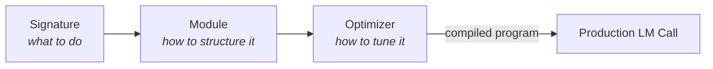
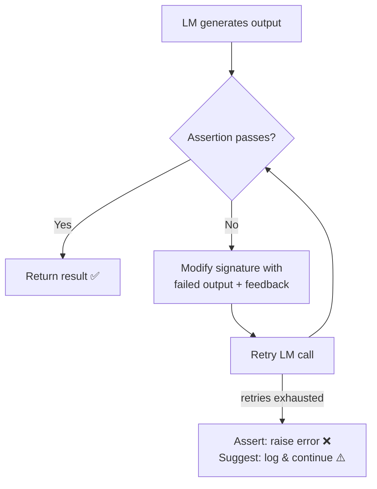
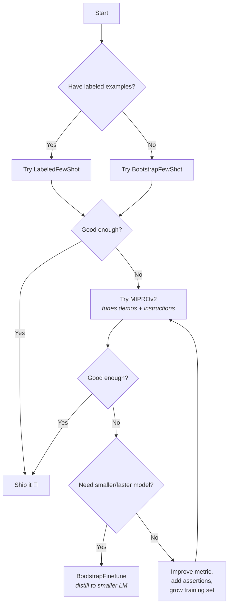

# Everything About DSPy

> **DSPy** (Declarative Self-improving Language Programs, Pythonically) is a framework by **Stanford NLP** that replaces brittle, hand-crafted prompts with modular, optimizable Python programs. You declare *what* the LM should do — DSPy figures out *how* to prompt it.

---

## Table of Contents

1. [The Problem DSPy Solves](#1-the-problem-dspy-solves)
2. [Installation & Setup](#2-installation--setup)
3. [Core Abstractions](#3-core-abstractions)
   - Signatures
   - Modules
   - Optimizers
4. [Language Model Configuration](#4-language-model-configuration)
5. [Signatures — Deep Dive](#5-signatures--deep-dive)
6. [Modules — Deep Dive](#6-modules--deep-dive)
7. [Building a RAG Pipeline](#7-building-a-rag-pipeline)
8. [Metrics & Evaluation](#8-metrics--evaluation)
9. [Assertions & Suggestions](#9-assertions--suggestions)
10. [Optimizers — Deep Dive](#10-optimizers--deep-dive)
11. [Typed Predictors & Pydantic](#11-typed-predictors--pydantic)
12. [Adapters](#12-adapters)
13. [Caching](#13-caching)
14. [Saving & Loading Programs](#14-saving--loading-programs)
15. [Best Practices](#15-best-practices)
16. [Cheatsheet](#16--dspy-cheatsheet)

---

## 1. The Problem DSPy Solves

Traditional LLM development looks like this:

```
Idea → Write prompt → Test → Tweak prompt → Test → Change model → Prompt breaks → Repeat ♻️
```

This is **prompt hacking** — fragile, untestable, and non-transferable. When you change the model, the pipeline, or the data, everything breaks.

DSPy treats the LM like a **programmable function**, not a text box:

| Traditional Prompting | DSPy Approach |
|:---|:---|
| Hand-write prompt templates | Declare input→output **signatures** |
| Manually pick few-shot examples | **Optimizers** auto-select the best demos |
| Prompt breaks on new model | Model-agnostic — swap LMs freely |
| No systematic evaluation | Built-in **metrics & evaluation** |
| Hard to compose multi-step flows | **Modules** compose like PyTorch layers |

---

## 2. Installation & Setup

```bash
pip install -U dspy
```

That's it. DSPy uses **LiteLLM** under the hood, so you get access to 100+ LM providers out of the box.

---

## 3. Core Abstractions

DSPy is built on three pillars:



| Abstraction | Analogy | Purpose |
|:---|:---|:---|
| **Signature** | Function type signature | Declares inputs & outputs |
| **Module** | PyTorch `nn.Module` | Wraps LM behavior (predict, reason, act) |
| **Optimizer** | PyTorch optimizer | Auto-tunes prompts, demos, or weights |

---

## 4. Language Model Configuration

DSPy uses a unified `dspy.LM` class powered by LiteLLM. The model string format is always `"provider/model_name"`.

### Global Setup

```python
import dspy

# OpenAI
lm = dspy.LM("openai/gpt-4o", api_key="sk-...")
dspy.configure(lm=lm)

# Anthropic
lm = dspy.LM("anthropic/claude-3-5-sonnet", api_key="sk-ant-...")
dspy.configure(lm=lm)

# Google Vertex AI
lm = dspy.LM("vertex_ai/gemini-2.0-flash")
dspy.configure(lm=lm)

# Local model via Ollama
lm = dspy.LM("ollama/llama3", api_base="http://localhost:11434")
dspy.configure(lm=lm)
```

### Extra Parameters

```python
lm = dspy.LM(
    "openai/gpt-4o",
    temperature=0.7,
    max_tokens=1000,
    cache=True           # enable response caching
)
```

### Scoped Override with Context Manager

```python
gpt4 = dspy.LM("openai/gpt-4o")
mini  = dspy.LM("openai/gpt-4o-mini")

dspy.configure(lm=gpt4)            # global default

with dspy.context(lm=mini):        # temporary override
    result = my_module(question="...")
```

> [!TIP]
> Set API keys via environment variables (`OPENAI_API_KEY`, `ANTHROPIC_API_KEY`) to avoid hardcoding them.

---

## 5. Signatures — Deep Dive

A **Signature** declares what the LM should do — its inputs and outputs — without specifying how to prompt it.

### Inline (Shorthand) Signatures

```python
# Simple Q&A
predict = dspy.Predict("question -> answer")

# Multiple outputs
predict = dspy.Predict("email -> urgency, team, summary")

# With descriptions in docstring form
predict = dspy.Predict("context, question -> answer")
```

### Class-Based Signatures (Recommended for Production)

```python
class Sentiment(dspy.Signature):
    """Classify the sentiment of a sentence."""

    sentence = dspy.InputField(desc="A user review or comment")
    sentiment = dspy.OutputField(desc="One of: positive, negative, neutral")
    confidence = dspy.OutputField(desc="Confidence score from 0.0 to 1.0")
```

### Field Options

| Parameter | Purpose | Example |
|:---|:---|:---|
| `desc` | Describes the field's purpose to the LM | `desc="a short summary"` |
| `prefix` | Custom prefix in the prompt | `prefix="Answer:"` |
| `format` | A callable to format the value | `format=lambda x: x.upper()` |

---

## 6. Modules — Deep Dive

Modules are the building blocks. They take a **Signature** and add a specific *behavior pattern* to the LM call.

### Module Catalog

| Module | What It Does | When to Use |
|:---|:---|:---|
| `dspy.Predict` | Direct input→output completion | Simple tasks (classification, extraction) |
| `dspy.ChainOfThought` | Adds a `rationale` field before the answer | Tasks needing step-by-step reasoning |
| `dspy.ChainOfThoughtWithHint` | CoT + a hint from the user | Guided reasoning with domain knowledge |
| `dspy.ReAct` | Iterative Reason→Act→Observe loop with tools | Tool-using agents, search, API calls |
| `dspy.ProgramOfThought` | Generates & executes Python code | Math, logic, data processing |
| `dspy.MultiChainComparison` | Samples M reasoning paths, picks the best | High-stakes accuracy tasks |
| `dspy.Retrieve` | Fetches passages from a retrieval model | RAG pipelines |

### Using Modules

```python
# 1. Simple prediction
classify = dspy.Predict("review -> sentiment")
result = classify(review="This product is amazing!")
print(result.sentiment)  # "positive"

# 2. Chain of Thought
cot = dspy.ChainOfThought("question -> answer")
result = cot(question="What is 23 * 47?")
print(result.rationale)  # step-by-step reasoning
print(result.answer)     # "1081"

# 3. ReAct Agent with tools
def search(query: str) -> str:
    """Search the web for information."""
    return "Tokyo population: 13.96 million"

agent = dspy.ReAct("question -> answer", tools=[search])
result = agent(question="What is the population of Tokyo?")

# 4. ProgramOfThought
pot = dspy.ProgramOfThought("question -> answer")
result = pot(question="What is the 15th Fibonacci number?")
```

### Composing Modules (Custom Programs)

Just like PyTorch — subclass `dspy.Module` and define `forward()`:

```python
class MultiHopQA(dspy.Module):
    def __init__(self):
        super().__init__()
        self.generate_query = dspy.ChainOfThought("context, question -> search_query")
        self.retrieve = dspy.Retrieve(k=3)
        self.generate_answer = dspy.ChainOfThought("context, question -> answer")

    def forward(self, question):
        context = []
        for hop in range(2):  # 2-hop retrieval
            query = self.generate_query(context=context, question=question).search_query
            passages = self.retrieve(query).passages
            context = deduplicate(context + passages)
        return self.generate_answer(context=context, question=question)
```

---

## 7. Building a RAG Pipeline

The classic DSPy use case — a full Retrieval-Augmented Generation pipeline:

```python
# Step 1: Define the Signature
class GenerateAnswer(dspy.Signature):
    """Answer the question based on the retrieved context."""
    context = dspy.InputField(desc="relevant facts from the knowledge base")
    question = dspy.InputField()
    answer = dspy.OutputField(desc="a concise, factual answer")

# Step 2: Build the Module
class RAG(dspy.Module):
    def __init__(self, num_passages=3):
        super().__init__()
        self.retrieve = dspy.Retrieve(k=num_passages)
        self.generate = dspy.ChainOfThought(GenerateAnswer)

    def forward(self, question):
        context = self.retrieve(question).passages
        return self.generate(context=context, question=question)

# Step 3: Configure & Run
lm = dspy.LM("openai/gpt-4o")
rm = dspy.ColBERTv2(url="http://20.102.90.50:2017/wiki17_abstracts")
dspy.configure(lm=lm, rm=rm)

rag = RAG()
result = rag(question="What castle did David Gregory inherit?")
print(result.answer)
```

### Step 4: Optimize It

```python
from dspy.teleprompt import BootstrapFewShot

def validate(example, pred, trace=None):
    return dspy.evaluate.answer_exact_match(example, pred)

optimizer = BootstrapFewShot(metric=validate)
compiled_rag = optimizer.compile(RAG(), trainset=trainset)

# Now compiled_rag has auto-selected few-shot demos!
```

---

## 8. Metrics & Evaluation

### Writing a Metric

A metric is a Python function with this signature:

```python
def my_metric(example, pred, trace=None):
    """
    Args:
        example: Gold-label data (dspy.Example)
        pred:    System prediction (dspy.Prediction)
        trace:   Execution trace (present during optimization, None during eval)
    Returns:
        float, int, or bool
    """
    # Simple exact match
    em = example.answer.lower() == pred.answer.lower()

    # During optimization, return binary pass/fail
    if trace is not None:
        return em

    # During evaluation, return a nuanced score
    return em * 1.0
```

### Built-in Metrics

```python
dspy.evaluate.answer_exact_match(example, pred)
dspy.evaluate.answer_passage_match(example, pred)
```

### Running Evaluation

```python
from dspy.evaluate import Evaluate

evaluator = Evaluate(
    devset=devset,
    num_threads=4,
    display_progress=True,
    display_table=5       # show 5 example rows
)

score = evaluator(compiled_rag, metric=my_metric)
print(f"Accuracy: {score}%")
```

> [!IMPORTANT]
> Always prepare your dataset with `.with_inputs()`:
> ```python
> trainset = [ex.with_inputs("question") for ex in raw_data]
> ```
> This tells optimizers which fields are inputs vs. labels.

---

## 9. Assertions & Suggestions

Assertions let you enforce **constraints** on LM outputs with automatic self-correction.

### `dspy.Assert` — Hard Constraint

If the check fails, DSPy **backtracks** and retries the LM call with feedback. If all retries fail, raises `dspy.AssertionError`.

```python
class FactualQA(dspy.Module):
    def __init__(self):
        super().__init__()
        self.generate = dspy.ChainOfThought("context, question -> answer")

    def forward(self, question, context):
        pred = self.generate(context=context, question=question)

        # Hard constraint: answer must cite context
        dspy.Assert(
            any(sent in pred.answer for sent in context),
            "Answer must include a direct quote from the context."
        )

        # Hard constraint: length check
        dspy.Assert(
            len(pred.answer.split()) >= 5,
            "Answer must be at least 5 words long."
        )

        return pred
```

### `dspy.Suggest` — Soft Constraint

Same self-correction mechanism, but **logs the failure and continues** instead of halting.

```python
dspy.Suggest(
    pred.answer.endswith("."),
    "Answer should end with a period for proper formatting."
)
```

### How Self-Correction Works



---

## 10. Optimizers — Deep Dive

Optimizers (formerly called **Teleprompters**) automatically tune your program. You provide a **metric** and **training data**, and the optimizer finds the best prompts, demos, or weights.

### Optimizer Comparison

| Optimizer | Tunes | Cost | Best For |
|:---|:---|:---|:---|
| `LabeledFewShot` | Demos (from labels) | 🟢 Cheapest | When you have hand-labeled examples |
| `BootstrapFewShot` | Demos (generated) | 🟢 Low | First try for most tasks |
| `BootstrapFewShotWithRandomSearch` | Demos | 🟡 Medium | Better demo selection |
| `COPRO` | Instructions | 🟡 Medium | Instruction-sensitive tasks |
| `MIPROv2` | Demos + Instructions | 🔴 High | Maximum performance |
| `BootstrapFinetune` | Model Weights | 🔴 Highest | Distilling to smaller models |

### Usage Examples

#### BootstrapFewShot

```python
from dspy.teleprompt import BootstrapFewShot

optimizer = BootstrapFewShot(
    metric=my_metric,
    max_bootstrapped_demos=4,    # max generated demos per module
    max_labeled_demos=4,         # max hand-labeled demos per module
    max_rounds=1                 # bootstrap iterations
)

compiled = optimizer.compile(student=RAG(), trainset=trainset)
```

#### MIPROv2

```python
from dspy.teleprompt import MIPROv2

optimizer = MIPROv2(
    metric=my_metric,
    num_candidates=10,    # candidate instructions to try
    init_temperature=1.0  # exploration temperature
)

compiled = optimizer.compile(
    student=RAG(),
    trainset=trainset,
    max_bootstrapped_demos=3,
    max_labeled_demos=3
)
```

#### BootstrapFinetune

```python
from dspy.teleprompt import BootstrapFinetune

optimizer = BootstrapFinetune(metric=my_metric)
compiled = optimizer.compile(
    student=RAG(),
    teacher=RAG(),       # can be a more powerful model
    trainset=trainset
)
# This generates a fine-tuning dataset and trains the student model
```

### Optimization Strategy Flowchart



---

## 11. Typed Predictors & Pydantic

For structured outputs, integrate **Pydantic** models directly into your signatures:

```python
from pydantic import BaseModel, Field
from dspy.functional import TypedPredictor

class ExtractedEntity(BaseModel):
    name: str = Field(description="Name of the entity")
    entity_type: str = Field(description="Type: PERSON, ORG, or LOCATION")
    confidence: float = Field(description="Confidence score 0.0–1.0")

class EntityExtraction(dspy.Signature):
    """Extract named entities from the text."""
    text = dspy.InputField()
    entities: list[ExtractedEntity] = dspy.OutputField()

extractor = TypedPredictor(EntityExtraction)
result = extractor(text="Elon Musk announced that Tesla will open a factory in Berlin.")
# result.entities → [ExtractedEntity(name="Elon Musk", ...), ...]
```

> [!TIP]
> Typed Predictors ensure your LM returns **valid, structured objects** — no more parsing messy text outputs.

---

## 12. Adapters

Adapters sit between your DSPy modules and the LM, handling prompt formatting and response parsing.

| Adapter | Description |
|:---|:---|
| `ChatAdapter` | Formats signatures as chat messages (default for chat models) |
| `JSONAdapter` | Forces JSON-structured output and parsing |
| Custom | Build your own for XML, YAML, or specialized formats |

### Adapter Workflow

```
Signature → Adapter.preprocess() → Adapter.format() → LM Call → Adapter.postprocess() → Prediction
```

Most users won't need to touch adapters — they work automatically. But they're available for advanced customization.

---

## 13. Caching

DSPy caches LM responses by default to avoid redundant API calls.

```python
# Global cache config
lm = dspy.LM("openai/gpt-4o", cache=True)   # default

# Disable for debugging / fresh responses
lm = dspy.LM("openai/gpt-4o", cache=False)
```

DSPy supports both **in-memory** and **on-disk** caching. This is especially important during optimization, where the same prompts may be evaluated multiple times.

---

## 14. Saving & Loading Programs

After expensive optimization, persist your compiled program:

### State-Only Save (Recommended)

Saves optimized instructions and demos as a **human-readable JSON** file:

```python
# Save
compiled_rag.save("optimized_rag.json")

# Load
rag = RAG()                        # create a fresh instance
rag.load("optimized_rag.json")     # apply optimized state
```

### Full Program Save

Saves the entire module structure using `cloudpickle`:

```python
# Save (includes code + state)
compiled_rag.save("optimized_rag.pkl", save_program=True)

# Load (no need to define the class)
import dspy
loaded_rag = dspy.load("optimized_rag.pkl")
```

> [!WARNING]
> Full program saves use `pickle` — only load from trusted sources.

---

## 15. Best Practices

| Area | Recommendation |
|:---|:---|
| **Signatures** | Keep them minimal and declarative. Let optimizers handle the prompt text. |
| **Data** | Start with 10–50 diverse examples. Quality > quantity. |
| **Metrics** | Make them program-aware — use `trace` to enforce intermediate quality. |
| **Optimization** | Start simple (`BootstrapFewShot`), escalate to `MIPROv2` as needed. |
| **Assertions** | Use `dspy.Assert` for critical constraints, `dspy.Suggest` for nice-to-haves. |
| **Models** | Develop with a powerful model, then distill with `BootstrapFinetune`. |
| **Version Control** | Save compiled programs and version your data alongside code. |
| **Debugging** | Use `lm.inspect_history(n=3)` to see the last N raw LM calls. |

---

## 16. 📋 DSPy Cheatsheet

### Setup

```python
pip install -U dspy

import dspy
lm = dspy.LM("openai/gpt-4o")          # or anthropic/claude-3-5-sonnet, ollama/llama3
dspy.configure(lm=lm)
```

---

### Signatures

```python
# Inline
"question -> answer"
"context, question -> answer"
"document -> summary, keywords"

# Class-based
class MyTask(dspy.Signature):
    """Instruction docstring goes here."""
    inp = dspy.InputField(desc="...")
    out = dspy.OutputField(desc="...")
```

---

### Modules

```python
dspy.Predict(sig)                           # direct completion
dspy.ChainOfThought(sig)                    # adds reasoning before answer
dspy.ChainOfThoughtWithHint(sig)            # CoT + user hint
dspy.ProgramOfThought(sig)                  # generates & runs Python code
dspy.ReAct(sig, tools=[fn1, fn2])           # tool-using agent loop
dspy.MultiChainComparison(sig, M=5)         # compare M reasoning paths
dspy.Retrieve(k=3)                          # retrieve k passages
```

---

### Custom Program

```python
class MyProgram(dspy.Module):
    def __init__(self):
        super().__init__()
        self.step1 = dspy.ChainOfThought("question -> query")
        self.step2 = dspy.Predict("query, context -> answer")

    def forward(self, question):
        q = self.step1(question=question).query
        ctx = self.retrieve(q)
        return self.step2(query=q, context=ctx)
```

---

### Metrics

```python
def metric(example, pred, trace=None):
    score = (example.answer.lower() == pred.answer.lower())
    return score

# Built-in
dspy.evaluate.answer_exact_match(example, pred)
```

---

### Evaluate

```python
from dspy.evaluate import Evaluate
evaluator = Evaluate(devset=devset, num_threads=4)
score = evaluator(my_program, metric=metric)
```

---

### Optimizers

```python
from dspy.teleprompt import BootstrapFewShot, MIPROv2, BootstrapFinetune

# Quick start
tp = BootstrapFewShot(metric=metric, max_bootstrapped_demos=4)
compiled = tp.compile(MyProgram(), trainset=trainset)

# Advanced
tp = MIPROv2(metric=metric, num_candidates=10)
compiled = tp.compile(MyProgram(), trainset=trainset)
```

---

### Assertions

```python
dspy.Assert(condition, "Error message for backtracking")   # hard — retries or raises
dspy.Suggest(condition, "Soft hint for self-correction")    # soft — retries or continues
```

---

### Data Prep

```python
example = dspy.Example(question="...", answer="...")
trainset = [ex.with_inputs("question") for ex in examples]
```

---

### Save / Load

```python
compiled.save("program.json")          # state only (recommended)
program = MyProgram()
program.load("program.json")
```

---

### Debugging

```python
lm.inspect_history(n=3)                # view last 3 raw LM calls
dspy.configure(trace=[])               # enable tracing
```

---

### Context Manager

```python
with dspy.context(lm=other_lm):        # temporary LM override
    result = my_module(question="...")
```

---

### LM Providers Quick Ref

| Provider | Model String |
|:---|:---|
| OpenAI | `"openai/gpt-4o"` |
| Anthropic | `"anthropic/claude-3-5-sonnet"` |
| Google | `"vertex_ai/gemini-2.0-flash"` |
| Ollama (local) | `"ollama/llama3"` |
| Any LiteLLM-supported | `"provider/model-name"` |
